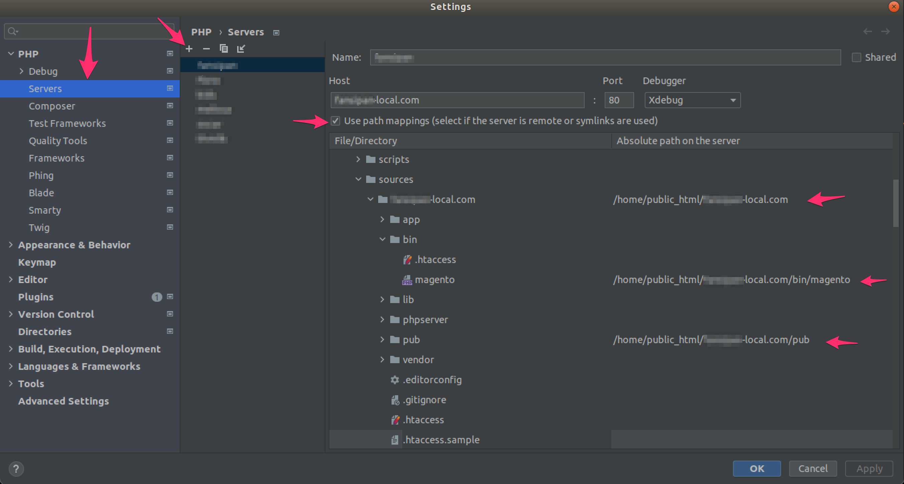

# MỤC LỤC
- [MỤC LỤC](#mục-lục)
- [GIỚI THIỆU](#giới-thiệu)
  - [Yêu cầu hệ thống](#yêu-cầu-hệ-thống)
    - [Giới thiệu hệ thống](#giới-thiệu-hệ-thống)
      - [Cấu trúc thư mục hệ thống](#cấu-trúc-thư-mục-hệ-thống)
      - [Các services được cấu hình sẵn trong hệ thống](#các-services-được-cấu-hình-sẵn-trong-hệ-thống)
      - [Các command của hệ thống](#các-command-của-hệ-thống)
      - [Hệ thống email catch all](#hệ-thống-email-catch-all)
- [HƯỚNG DẪN SỬ DỤNG](#hướng-dẫn-sử-dụng)
  - [Các lệnh docker/docker-compose cơ bản](#các-lệnh-dockerdocker-compose-cơ-bản)
  - [Hướng dẫn sử dụng hệ thống](#hướng-dẫn-sử-dụng-hệ-thống)
  - [Bắt đầu sử dụng](#bắt-đầu-sử-dụng)
  - [Xoá dữ liệu](#xoá-dữ-liệu)
  - [Một số ví dụ](#một-số-ví-dụ)
    - [Khởi tạo và chạy nginx, php72, mysql](#khởi-tạo-và-chạy-nginx-php72-mysql)
    - [Khởi tạo thêm php72](#khởi-tạo-thêm-php72)
    - [Bật Xdebug cho php72](#bật-xdebug-cho-php72)
    - [Tạo database với tên yoyoyo](#tạo-database-với-tên-yoyoyo)
    - [Import file backup vào database yoyoyo](#import-file-backup-vào-database-yoyoyo)
    - [Export (backup) database tên yoyoyo](#export-backup-database-tên-yoyoyo)
    - [Drop database với tên yoyoyo](#drop-database-với-tên-yoyoyo)
    - [Tự động tải và cài đặt Magento](#tự-động-tải-và-cài-đặt-magento)
    - [Bật SSL cho domain](#bật-ssl-cho-domain)
    - [Sử dụng varnish cho domain](#sử-dụng-varnish-cho-domain)
    - [Các bước chạy 1 site magento dự án clone từ git02 về](#các-bước-chạy-1-site-magento-dự-án-clone-từ-git02-về)
# GIỚI THIỆU
Combo docker-compose cho Magento với các tính năng như:

* Chạy được đồng thời nhiều phiên bản PHP, bạn không cần phải tạo tạo nhiều stack docker-compose khác nhau cho nhiều project, mà chỉ cần dùng 1 stack docker-compose duy nhất.
* Tự động tạo Virtual host cho nginx, hỗ trợ Magento 1, Magento 2, Laravel, Wordpress.
* Hỗ trợ SSL
* Tự động tải, cài đặt Magento fresh các phiên bản theo yêu cầu.
* Tạo/Drop/Import/Export database từ command.
* Bật tắt Xdebug ứng với từng phiên bản PHP.
* Tự động add các domain sử dụng vào /etc/hosts.
* Email catch all local, tránh tình trạng gửi email ra ngoài internet (tất nhiên thì vẫn phải nhớ check xem config SMTP đừng có để configure của prod =)))
* Hỗ trợ nvm, grunt.
* Log nginx được lưu riêng trong thư mục logs/nginx

Hiện tại mới test trên Ubuntu, các hệ điều hành khác mọi người vui lòng tự mò =).

## Yêu cầu hệ thống
* Hệ thống cần có cài đặt docker và docker-compose (docker-compose cần cài bản mới nhất thông qua hướng dẫn sau, lưu ý không cài đặt docker-compose thông qua python pip - đây là phiên bản cũ ). Hướng dẫn cài đặt có thể tham khảo Google hoặc:

[Hướng dẫn cài đặt docker trên Ubuntu](https://docs.docker.com/engine/install/ubuntu/)

```bash
# Hướng dẫn cài đặt docker-compose trên Ubuntu
sudo curl -L https://github.com/docker/compose/releases/download/1.28.5/docker-compose-Linux-x86_64 -o /usr/local/bin/docker-compose
chmod +x /usr/local/bin/docker-compose
```

* Cài xong docker thì nhơ chạy lệnh này để add user máy mình đang chạy được quyền chạy docker mà không cần gõ sudo, gõ xong thì nhớ logout rồi login lại:
```bash
sudo usermod -aG docker $USER
```
### Giới thiệu hệ thống
```bash
❯ tree
.
├── README.md
├── build
│   ├── elasticsearch
│   │   └── Dockerfile
│   ├── nginx
│   │   ├── Dockerfile
│   │   └── conf
│   │       └── nginx.conf
│   ├── php70
│   │   └── Dockerfile
│   ├── php71
│   │   └── Dockerfile
│   ├── php72
│   │   └── Dockerfile
│   ├── php73
│   │   └── Dockerfile
│   ├── php74
│   │   └── Dockerfile
│   ├── php74-c2
│   │   └── Dockerfile
│   ├── php81-c2
│   │   └── Dockerfile
│   └── varnish
│       └── Dockerfile
├── conf
│   ├── nginx
│   │   ├── conf.d
│   │   ├── nginx.conf
│   │   └── ssl
│   ├── php
│   │   ├── php70
│   │   │   ├── 10-opcache.ini
│   │   │   ├── magento.conf
│   │   │   └── php.ini
│   │   ├── php71
│   │   │   ├── 10-opcache.ini
│   │   │   ├── magento.conf
│   │   │   └── php.ini
│   │   ├── php72
│   │   │   ├── 10-opcache.ini
│   │   │   ├── magento.conf
│   │   │   └── php.ini
│   │   ├── php73
│   │   │   ├── 10-opcache.ini
│   │   │   ├── magento.conf
│   │   │   └── php.ini
│   │   ├── php74
│   │   │   ├── 10-opcache.ini
│   │   │   ├── magento.conf
│   │   │   └── php.ini
│   │   ├── php74-c2
│   │   │   ├── 10-opcache.ini
│   │   │   ├── magento.conf
│   │   │   └── php.ini
│   │   ├─ php81-c2
│   │   │   ├── 10-opcache.ini
│   │   │   ├── magento.conf
│   │   │   └── php.ini
│   │   └── php82
│   │       ├── 10-opcache.ini
│   │       ├── magento.conf
│   │       └── php.ini
|   |   
│   └── varnish
│       └── default.vcl
├── data
├── databases
│   ├── export
│   └── import
├── docker-compose.yml
├── env-example
├── images
│   ├── cert.png
│   ├── cert02.png
│   ├── cert03.png
│   └── xdebug-phpstorm-01.png
├── logs
│   └── nginx
├── scripts
│   ├── create-vhost
│   ├── database
│   ├── fixowner
│   ├── init-magento
│   ├── list-services
│   ├── mysql
│   ├── setup-composer
│   ├── shell
│   ├── ssl
│   ├── varnish
│   └── xdebug
└── sources

32 directories, 48 files
```
#### Cấu trúc thư mục hệ thống

| Thư mục | Chức năng |
|---------|-----------|
| build   | Chứa các file sử dụng trong quá trình build container sử dụng cho hệ thống |
| conf | Chứa các file config cho container sử dụng trong quá trình người dùng sử dụng |
| data | Chứa các dữ liệu cho các container như mysql, rabbitMQ |
| database | Folder sử dụng cho các chức năng import/export database |
| images | Folder ảnh của cái README.md này, LOL |
| logs | Folder chứa log nginx cho tiện theo dõi ngoài hệ thống |
| scripts | Folder chứa các command chức năng sử dụng cho hệ thống |
| sources | Folder chứa các thư mục sources của các website dự án |

#### Các services được cấu hình sẵn trong hệ thống

* Hệ thống đã được cấu hình sẵn các services sau:

| Tên services | Giải thích |
|--------------|------------|
| nginx | service webserver nginx |
| php70 | service php version php 7.0 |
| php71 | service php version php 7.1 |
| php72 | service php version php 7.2 |
| php73 | service php version php 7.3 |
| php74-c2 | service php version php 7.4 sử dụng composer2|
| php81-c2 | service php version php 8.1 sử dụng composer2|
| php82 | service php version php 8.2 sử dụng composer2|
| php74 | service php version php 7.4 |
| mysql | service mysql, default sử dụng version 8.0 |
| mailhog | service email catch all |
| elasticsearch | service Elastiscsearch |
| kibana | service Kibana |
| redis | service Redis  |
| rabbitmq | service RabbitMQ  |
| phpmyadmin | service phpmyadmin  |
| phpredmin | service phpredmin  |
| varnish | service varnish  |


#### Các command của hệ thống
| Command | Tác dụng |
|---------|----------|
| create-vhost | Tự động tạo virtual host cho services nginx ứng với từng loại magento và version php |
| database | create/drop/import/export/list databases | 
| fixowner | Command sử dụng để change lại owner của thư mục source code đúng với default mà hệ thống sử dụng |
| init-magento | Command sử dụng để tự động tải về và cài đặt Magento lên hệ thống |
| list-services | Command sử dụng để list các services mà docker-compose đã khởi tạo và đang chạy |
| mysql | Command sử dụng để tương tác với mysql shell trong mysql container |
| setup-composer | Composer sử dụng để setup auth.json default cho repo của Magento trong trường hợp cần thiết |
| shell | Command sử dụng để truy cập vào các container php với user dùng để chạy website, không dùng user root |
| ssl | Command sử dụng để tạo Virtual host SSL cho các domain được lựa chọn |
| xdebug | Command sử dụng để bật/tắt xdebug của 1 service php được lựa chọn |
| varnish | Command sử dụng để bật/tắt varnish của 1 domain được lựa chọn |

#### Hệ thống email catch all

* Hệ thống có được cấu hình thêm sử dụng email catch all dùng Mailhog để có thể test mail trên local mà không cần cấu hình SMTP với các thông tin public.
* Mặc định hệ thống nếu không cấu hình SMTP, các service PHP đều sẽ gửi email thông qua Mailhog, do đó khi start hệ thống cần start thêm service Mailhog
* Trường hợp Mailhog đã được start, có thể kiểm tra email đã được gửi thông qua Mailhog bằng cách truy cập đường dẫn sau trên trình duyệt: [http://localhost:8025](http://localhost:8025)
* Trường hợp muốn cấu hình SMTP sử dụng Mailhog cho Magento, có thể sử dụng thông tin kết nối sau: 

|   |   |
|---|---|
| SMTP Server | mailhog |
| SMTP Port | 1025 |
# HƯỚNG DẪN SỬ DỤNG
## Các lệnh docker/docker-compose cơ bản
* Xài docker thì cũng nên biết 1 số lệnh cơ bản sau:
```bash
# Xem thông tin các docker container đang chạy sử dụng docker-compose.yml tại thư mục hiện hành
docker-compose ps 

# Xem thông tin tài nguyên mà các container đang sử dụng
docker stats

# List tất cả các serices được khai báo trong file docker-compose.yml
docker-compose ps --services

# List tất cả các server được khai báo trong file docker-compose.yml đang ở trạng thái running
docker-compose ps --services --filter "status=running"

# Khởi tạo toàn bộ các services (containers) được khai báo trong file docker-compose.yml
docker-compose up -d

# Check log của 1 container nào đó (ngoài php, nginx), ví dụ logs của elasticsearch
docker-compose log elasticsearch

# Khởi tạo và chạy một số services (container) được lựa chọn, chứ không khởi động toàn bộ services (container) được khai báo trong docker-compose.yml - Ví dụ chỉ khởi tạo và chạy nginx, php72, mysql
docker-compose up -d nginx php72 mysql

# Stop và xoá toàn bộ các services (containers) tạo và đang chạy được khai vào trong file docker-compose.yml, bao gồm cả volumes (không bao gồm file trong thư mục ./data/)
docker-compose down --remove-orphans

# Tắt các services (container) đang chạy được khai báo trong file docker-compose.yml - Kiểu tắt 1 xíu cho đỡ nặng máy rồi tí khởi động lại.
docker-compose stop

# Khởi động các services (container) đã khởi tạo được khai báo trong file docker-compose.yml - services (container) nào mà không khởi tạo trước đó thì sẽ vẫn không được khởi tạo và không được start.
docker-compose start

# Restart lại các services (container) đang chạy
docker-compose restart

# Chui vô 1 services để chạy command - Ví dụ tính chui vô container service php72 để chạy composer
docker-compose exec php72 bash

# Restart lại container php sau khi thay đổi giá trị nào đó trong php.ini, ví dụ cần restart container php72
docker-compose restart php72
```
* Các services nội bộ có thể kết nối với nhau thông qua tên của services. Ví dụ có thể điền Mysql host thay vì localhost là mysql. Hoặc kết nối tới các services elasticsearch, redis thay vì localhost thì để là elasticsearch và redis, các port kết nối vẫn là port mặc định v.v.

## Hướng dẫn sử dụng hệ thống

* Clone repo này vào một thư mục trên máy
* Copy file env-example thành .env
* Đổi thông tin cần thiết nếu có trong file .env trước khi chạy.
* MySQL được mount port ra ngoài thông qua port 3308, trong trường hợp bạn muốn kết nối tới container mysql từ máy vật lý thông qua phần mêm như MySQL Workbench, bạn có thể connect với thông tin host: 127.0.0.1, port: 3308
* phpmyadmin được mount port ra ngoài máy vật lý thông qua port 8080
* phpredmin được mount port ra ngoài máy vật lý thông qua port 8081, và với thông tin User: admin, Password: admin
* Trường hợp sau một thời gian sử dụng, bạn có build lại image mà bị lỗi, bạn có thể sử dụng câu lệnh build sau để bỏ qua docker cache được lưu trước đó, ví dụ bạn cần build image php81-c2
```bash
docker-compose build --no-cache php81-c2
```

**Lưu ý:**
* Mọi command khi chạy trên hệ thống cần chạy trong thư mục chứa file docker-compose.yml
* Source code website cần được để trong 1 thư mục riêng trong thư mục sources. Nên để tạo thư mục dạng sources/domain.com và clone sources code vào thư mục này. Source code nên để trực tiếp trong thư mục sources/domain.com/ chứ không để trong sources/domain.com/src, trong trường hợp để trong sources/domain.com/src cần lưu ý trong bước tạo virtual host của nginx.
* Các command sử dụng cần được gọi theo dạng ./scripts/ten_command. Ví dụ: ./scripts/xdebug enable --php-version=php72
* Các command đều có hướng dẫn sử dụng riêng, có thể xem hướng dẫn bằng cách gõ command trong shell, ví dụ:
```bash
user@local:~/docker-magento$./scripts/xdebug
Docker Xdebug tools
Version 1

./scripts/xdebug [OPT] [ARG]...

    Options:
        enable                    Enable Xdebug.
        disable                   Disable Xdebug.
        status                    List all Xdebug status.
    Args:
        --php-version             PHP version used for Xdebug (php70|php71|php72|php73|php74).
        -h, --help                Display this help and exit.

    Examples:
      Disable Xdebug for PHP 7.2
        ./scripts/xdebug disable --php-version=php72
      Enable Xdebug for PHP 7.3
        ./scripts/xdebug enable --php-version=php73


                ____  __  __    _    ____ _____ ___  ____   ____
               / ___||  \/  |  / \  |  _ \_   _/ _ \/ ___| / ___|
               \___ \| |\/| | / _ \ | |_) || || | | \___ \| |
                ___) | |  | |/ ___ \|  _ < | || |_| |___) | |___
               |____/|_|  |_/_/   \_\_| \_\|_| \___/|____/ \____|


################################################################################
```
## Bắt đầu sử dụng
```bash
# Clone về 1 thư mục
git clone https://github.com/picassio/docker-magento-multiple-php.git ~/docker-mangento
# Chuyển đến thư mục
cd ~/docker-mangento
# Tạo file .env
cp env-example .env
# Chỉnh sửa thông tin file .env nếu cần thiết
# Khởi tạo hệ thống theo như cầu, ví dụ cần chạy nginx, php72, mysql, mailhog
docker-compose up -d nginx php72 mysql mailhog
# Khởi tạo thêm service nếu cần thêm, ví dụ hệ thống cần chạy thêm elasticsearch, redis
docker-compose up -d redis elasticsearch
# List các services đang chạy
./scripts/list-services

```
## Xoá dữ liệu

Trong trường hợp bạn muốn xoá toàn bộ dữ liệu (do rảnh quá, thích tạo cái mới trắng tinh chơi, lol), bạn cần xoá các thư mục sau:

- Các thư mục chứa source code trong: ./data/
- Các file nginx config trong: ./conf/nginx/conf.d/
- Stop và xoá các container cũng như các docker volume cũ, để stop container và xoá container/volume có thể chạy lệnh:
```bash
docker-compose down -v --remove-orphans
```

## Một số ví dụ

### Khởi tạo và chạy nginx, php72, mysql, mailhog
Default hệ thống sẽ gửi mail thông qua mailhog, do đó khi tạo bất cứ 1 stack mới nào cần start thêm mailhog.
```bash
docker-compose up -d nginx php72 mysql mailhog
```
### Khởi tạo thêm php72
```bash
docker-compose up -d nginx php73 mysql
```
### Bật Xdebug cho php72
```bash
./scripts/xdebug enable --php-version=php72
```

* Lưu ý: Để sử dụng Xdebug với PHP Storm, cần cấu hình thêm Map path trong PHP Storm setting. Mục Absolute path onn the server là path của website trong docker container:


### Tạo database với tên yoyoyo
```bash
./scripts/database create --database-name=yoyoyo
```
### Import file backup vào database yoyoyo
* File backup cần import vào cần có tên dạng .sql. Ví dụ: backup-test.sql
* File backup cần import vào cần để trong thư mục ./databases/import
```bash
./scripts/database import --source=backup-test.sql --target=yoyoyo
```
### Export (backup) database tên yoyoyo
```bash
./scripts/database export --database-name=yoyoyo
```
### Drop database với tên yoyoyo
```bash
./scripts/database drop --database-name=yoyoyo
```
### Tự động tải và cài đặt Magento
* Tự động tải và cài đặt Magento bản community version 2.3.4, sử dụng domain test.com, chạy với php7.2 
```bash
./scripts/init-magento  --php-version=php72 --domain=test.com --mangeto-version=2.3.4 --magento-edition=community
```
### Bật SSL cho domain
* Bật SSL cho domain test.com
* Sau khi bật cần chỉnh lại databse của mangeto, phần URL sang dùng https
```bash
./scripts/ssl --domain=test-magento.com
```
### Sử dụng varnish cho domain
```bash
# Bật varnish
./scripts/varnish-test enable --domain=test.com

# Tắt varnish
./scripts/varnish-test disable --domain=test.com

# Check varnish status
./scripts/varnish-test status --domain=test.com

```
### Các bước chạy 1 site magento dự án clone từ git02 về
* Mọi command thực hiện cần đứng ở thư mục chứa file docker-compose.yml
* Chọn domain cần sử dụng cho dự án, ví dụ magento-test.com, tạo thư mục chứa source code 
```bash
mkdir -p ./sources/magento-test.com
* Clone source code từ git về thư mục vừa tạo
```bash
git clone http://gitrepo.com ./sources/magento-test.com
```
* Tạo database cho website, ví dụ: magento_db
```bash
./scripts/database create --database-name=magento_db
```
* Copy file backup DB của website vào thư mục ./databases/import
* Chạy command import DB, ví dụ
```bash
./scripts/database import --source=backup-test.sql --target=magento_db
```
* Chọn phiên bản php cần chạy. Trong trường hợp chưa khởi tạo, khởi tạo trên hệ thống ví dụ php version cần sử dụng là php7.3
```bash
docker-compose up -d php73
```
* Tạo Vhost cho nginx container service
* Lúc này root dir thay vì ./sources/magento-test.com sẽ chỉ cần để tên thư mục source code trong thư mục ./sources/ là magento-test.com. Trong trường hợp source code của Magento ở trong ./sources/magento-test.com/src thì --root-dir=magento-test.com/src
```bash
./scripts/create-vhost --domain=magento-test.com --app=magento2 --root-dir=magento-test.com --php-version=php73
```
* Copy file env.php, config.php vào đúng thư mục, chỉnh sửa lại thông tin kết nối db. Password root mysql có được khai báo trong file .env
```bash
                'host' => 'mysql',
                'dbname' => 'magento_db',
                'username' => 'root',
                'password' => 'root',
```
* Truy cập vào container php73 để chạy các command build
```bash
./scripts/shell php73
cd magento-test.com
# Chạy command build j đó của bạn, lưu ý ko chạy sudo
```