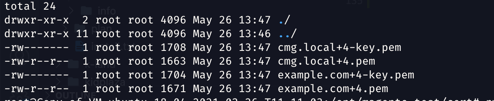
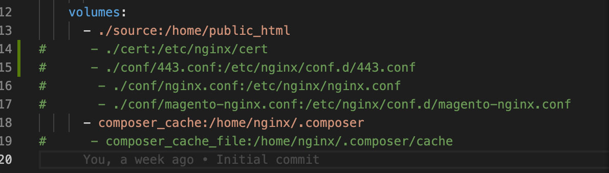
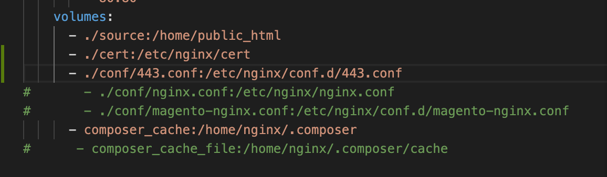

# How to use
## Create folder for project
```bash
mkdir -p /path/to/project
cd /path/to/project
```

## Clone docker-compose
```bash
git clone https://git02.smartosc.com/tuanlh/docker-magento-72.git /path/to/project/
```
## Create source folder
```bash
mkdir /path/to/project/source
```
## Build docker images, start docker container
```bash
cd /path/to/project
docker-compose build
docker-compose up -d
chown -R 1000:1000 ./source/
```
## Clone source code if needed
```bash
cd ./source
git clone https://git02.smartosc.com/user/project.git ./
chown -R 1000:1000 ./
```

# New install Magento

```bash
# cd to the project folder
cd /path/to/project/
# Login to to container
docker-compose exec nginx-php bash
#Login to the user use to running website
su - nginx 
# cd to the web folder
cd /home/public_html
# Create magento project
composer create-project --repository-url=https://repo.magento.com/ magento/project-community-edition=2.3 .
# Setup Magento
php bin/magento setup:install \
--base-url="http://cmg.local/" \
--db-host="mysql" \
--db-name="magento" \
--db-user="root" \
--db-password="magentosmartosc123" \
--admin-firstname="admin" \
--admin-lastname="admin" \
--admin-email="user@example.com" \
--admin-user="admin" \
--admin-password="admin123" \
--language="en_US" \
--currency="USD" \
--timezone="America/Chicago" \
--use-rewrites="1" \
--backend-frontname="admin" \
--cleanup-database
```
# Install from exited repo 

```bash
# cd to the source folder
cd /path/to/project/source
# Clone project source
git clone https://git02.smartosc.com/user/project.git ./
# Set owner/group
chown -R 1000:1000 ./

# Login to the container
docker-compose exec nginx-php bash
# Login to the user use to run website
su - nginx 
# cd to source folder
cd /home/public_html
# Composer install
composer install
# Setup website
php bin/magento setup:install \
--base-url="http://cmg.local/" \
--db-host="mysql" \
--db-name="magento" \
--db-user="root" \
--db-password="magentosmartosc123" \
--admin-firstname="admin" \
--admin-lastname="admin" \
--admin-email="user@example.com" \
--admin-user="admin" \
--admin-password="admin123" \
--language="en_US" \
--currency="USD" \
--timezone="America/Chicago" \
--use-rewrites="1" \
--backend-frontname="admin" \
--cleanup-database
```


# Test email with mailhog
```bash
/usr/local/bin/mhsendmail --smtp-addr="172.16.16.54:1025" test@mailhog.local <<EOF
From: Salman <kinsta@mailhog.local>
To: Test <test@mailhog.local>
Subject: Hello, MailHog!

Hey there,
Missing you pig time.

Hogs & Kisses,
Salman
EOF
```

# Install local SSL
## Install mkcert on Ubuntu
```bash
# Install mkcert
apt install libnss3-tools
wget https://github.com/FiloSottile/mkcert/releases/download/v1.4.3/mkcert-v1.4.3-linux-amd64 -O /usr/local/bin/mkcert
chmod +x /usr/local/bin/mkcert
# Generate Local CA
mkcert -install

# Create cert store folder
mkdir cd /path/to/project/cert
# Generate Local SSL Certificates
cd /path/to/project/cert
sudo mkcert example.com '*.example.com' localhost 127.0.0.1 ::1
# Cert will be store in the current folder 
```


## Edit conf/443.conf with  the name of the cert file name, EG:
### From:
```bash
    ssl_certificate /etc/nginx/ssl/fullchain.pem;
    ssl_certificate_key /etc/nginx/ssl/privkey.pem;
```
### To:
```bash
    ssl_certificate /etc/nginx/cert/example.com+4.pem;
    ssl_certificate_key /etc/nginx/cert/example.com+4-key.pem;
```

## Uncomment mount docker-compose nginx-php services mount cert file
### From:


### To:


### Recreate nginx-php services
```bash
docker-compose up -d nginx-php
```

# EXTRA
## How to restart nginx or php on nginx-php container
Run this command inside nginx-php container
```bash
supervisorctl restart nginx
# Or
supervisorctl restart php-fpm
```
Or running this command inside docker-compose folder
```bash
docker-compose exec nginx-php supervisorctl restart nginx
# Or 
docker-compose exec nginx-php supervisorctl restart php-fpm
```